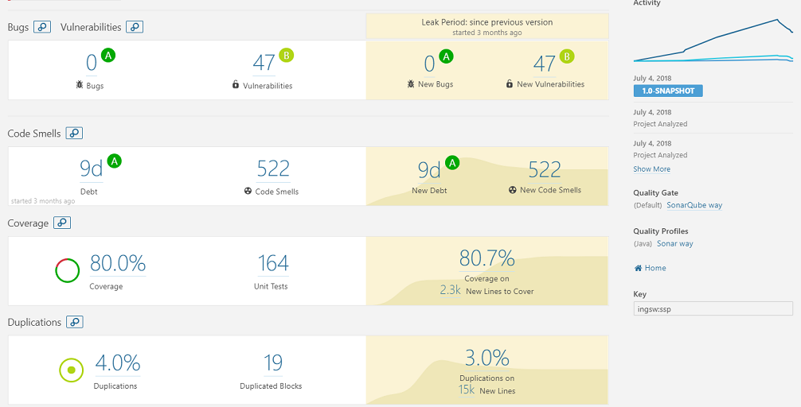
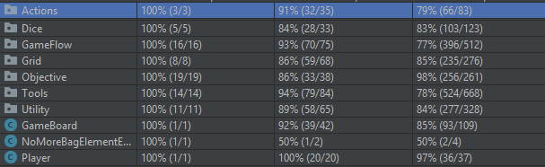

# ing-sw-2018-Student One-Student Two-poggi

# Final Project [2017-2018] Progetto di Ingegneria del Software

## Team

##### 1 - Student One
##### 2 - Student Two
##### 848920 - Gianmarco Poggi

## Jar

[Client](client.jar)

[Server](server.jar)

Il jar del server necessità della cartella ./Grids da cui va a prendere i file json da caricaricare in maniera dinamica e config.properties 

## Test Coverage

 

Coverage dei test e della qualita del codice di sonar, la percentuale di coverage fa riferimento alla sezione del model.

Coverage dei test delle sezioni del model ottenute tramite IntelliJ (rispettivamente coverage Classi, Metodi, Righe)

## UML

[UML Folder](documentation/uml/)

## Requisiti sviluppati

* Regole complete
* CLI & GUI
* RMI & Socket
* FA:
    1) Single Player
    2) Carte Schema Dinamiche
    
## Documentazione estesa e scelte di design

Una documentazione estesa con le scelte dettagliate di progetto è disponibilile qua: [doc.md](doc.md)
 
