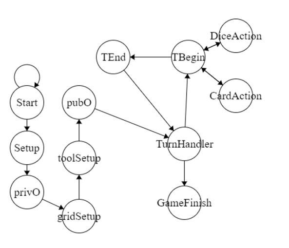
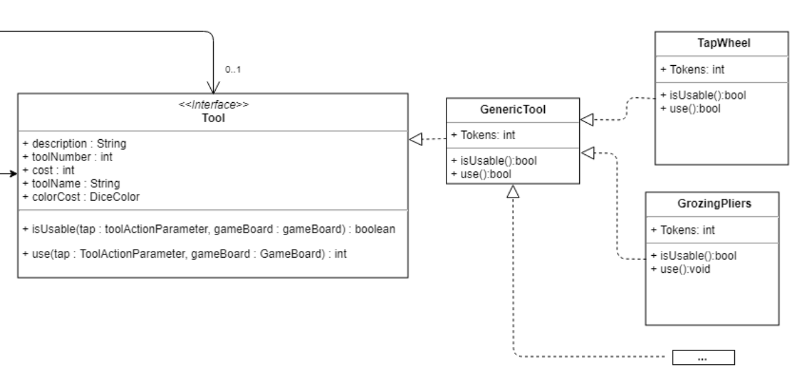
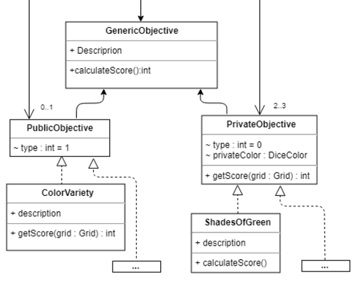
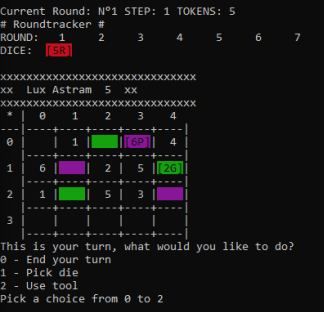
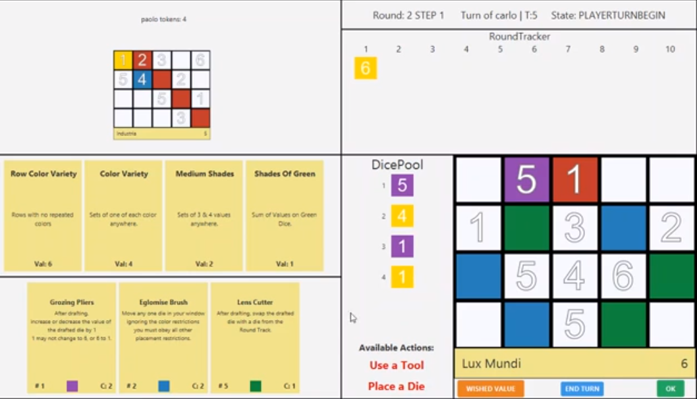
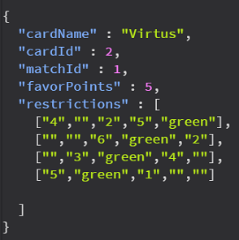
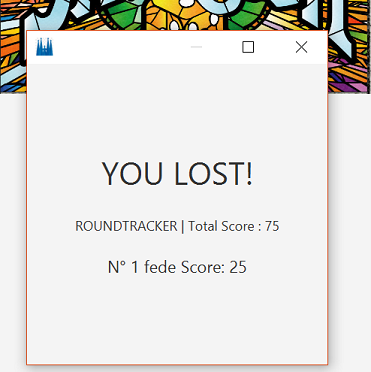

# SAGRADA

## Requisiti sviluppati
* Regole complete
* CLI & GUI
* RMI & Socket
* FA:
    1) Single Player
    2) Carte Schema Dinamiche

## Logica principale di gioco

La logica principale del gioco è presente lato server ed è gestita tramite una macchina a stati che assicura una corretta esecuzione dei flussi di gioco. 
Abbiamo scelto di utilizzare un design pattern basato su State Machine, ogni stato presenta un metodo execute che viene chiamato da GameFlow Handler. 
Questa separazione fra stati ci permette di tenerli separati fra di essi, ognuno avrà come unico compito di gestire la propria esecuzione e di selezionare opportunamente il prossimo stato a cui transizionare.

## Azioni dei giocatori 

I principali modi con cui i giocatori possono interagire con il gioco è tramite il piazzamento dei dadi e l’utilizzo dei tool. 
Queste azioni vengono svolte in due modi differenti, per comodità d’uso dell’utente, in base se utilizziamo la CLI o la GUI

#### Lato CLI 
Nel piazzamento dadi un’ helper segue l’utente per la selezione del dado e delle coordinate
Nell’utilizzo dei tool l’utente viene invece “guidato” all’utilizzo di un linguaggio ad hoc per specificare come viene utilizzato il tutto, abbiamo preferito questa soluzione rispetto ad una guidata in questo caso per non implementare lato client una logica per ogni tool relativa a che parametri ha bisogno. 
Questo ci consente anche di mantenere compatibilità con eventuali tool futuri.

#### Lato GUI
Gli elementi grafici sono “clickabili”, l’azione del selezionare/deselezionare, oltre ai rispettivi effetti visivi, è considerata da un oggetto che si occupa di gestire l’interazione con essi. Al momento della conferma si è in grado di capire, dagli elementi selezionati se l’azione svolta dall’utente corrisponde a l’utilizzo di un tool o di un piazzamento di un dado e opera di conseguenza.

In entrambi i casi, GUI e CLI, il server riceve la richiesta e procede a verificare la fattibilità e nel caso la esegue. Eventuali casi di impossibilità vengono segnalati indietro all’utente tramite una eccezione personalizzata: GameException che specifica il motivo dietro l’esito (es: Regole piazzamento infrante, Token insufficienti per pagare il Tool, …)

Lato CLI questa notifica viene visualizzata su riga di comando mentre se si gioca con la GUI essa compare a schermo sotto forma di popup

## Sacche

I Dadi, I Tool, gli Obiettivi e le Griglie di gioco sono gestiti da delle rispettivi classi “Bag”
Esse si occupano di mantenere coerente l’accesso alle risorse, in particolare evitano l’estrazione di un certo elemento più volte e si prendono carico dell’inizializzazione degli stessi.

In casi particolari come quello delle griglie la sacca implementa anche parte della logica relativa il pairing di griglie che nel gioco reale sono su facce opposte. 

## Gestione Tool

I tool sono stati implementati seguendo il command-pattern. 
I tool derivano da una superclasse comune e implementano due metodi: isUsable e Use
Entrambi fanno uso di GameBoard, la classe che contiene lo “stato” del gioco in corso, e di ToolActionParameter, un’ oggetto che contiene tutti i parametri passati dal client per l’utilizzo. 

Abbiamo optato per due oggetti molto generici in modo da delegare la responsabilità del funzionamento ai tool stessi e concedere a loro uno elevata libertà di azioni eseguibili. 

Per evitare ripetizione del codice, funzioni frequentemente utilizzate (come il pagamento da parte del player o l’interazione con la riserva dei dadi) sono state astratte in funzioni helper presenti nella superclasse genericTool. 

Il metodo isUsable permette di verificare se un tool è effettivamente utilizzabile nel modo descritto dall’utente (e ritorna messaggi di errore pertinenti specificando eventuali errori) mentre il metodo Use mette in atto gli effetti del tool.

I tool presentano inoltre alcune attributi quali descrizione, nome e costo che sono utilizzati lato CLI e GUI per mostrare all’utente le informazioni utili.

L’utilizzo del command pattern ci permette una elevata flessibilità all'eventuale introduzione di nuovi tool. La creazione di un nuovo tool corrisponde alla creazione della nuova classe corrispondente e alla istanziazione nella Sacca dei tool di esso, senza che altre classi vengano modificate in quanto operano con l’interfaccia comune Tool.

Comportamento particolare di certi Tool è lo svolgimento di essi in più fasi, abbiamo di conseguenza pensato ad un sistema basato sulla scomposizione di un azione in più fasi.

## Gestione Obiettivi

In maniera simile ai Tool gli obiettivi sono anch'essi creati con il command pattern
In questo caso però abbiamo un sottodivisione in PublicObjective e PrivateObjective e un unico metodo per calcolare il punteggio che l'obiettivo fornisce su una determinata griglia passata come parametro.

In particolare PrivateObjective contiene il metodo comune per calcolare il punteggio fornito sul colore dell'obiettivo stesso, mentre PublicObjective delega alla particolare classe come esso deve essere calcolato (per permettere un grado di libertà più ampio).

## CLI vs GUI

E possibile giocare con qualsiasi dei due sistemi di gioco, è anche possibile disconnettersi durante l’utilizzo di uno di essi e riconnettersi con l’altro. GUI e CLI sono selezionabili ad inizio partita e sono implementazione di una classe comune, che gestisce la connessione base lato rete del gioco. La GUI è realizzata tramite JavaFX mentre la CLI viene visualizzata su console con un supporto per colori basato su JANSI.

## GUI & JavaFX (specifico)

La GUI è stata progettata per avere uno stage unico, nel quale vengono visualizzate le scene delle principali fasi di gioco:
Registrazione dei players
Lobby pre-partita
Selezione grids
Creazione vetrate

Le scene più semplici come la Lobby vengono generate da codice, utilizzando gli elementi di JavaFX, per quelle più articolate, come la Selezione delle Grid o la Creazione delle Vetrate, abbiamo predisposto degli scheletri FXML che vengono caricati a runtime dalla cartella Resource del progetto.

La scena principale è quella con cui i giocatori interagiscono per creare la vetrata. Abbiamo scelto di mostrare in essa tutte le informazione che un player potrebbe voler utilizzare, senza sovraccaricarlo con informazioni a lui non pertinenti.

Informazioni come la disconnessione di un altro giocatore vengono comunicate al player attraverso un piccolo “pane” di notifica a scomparsa, renderizzato nell’angolo in basso a sinistra, indipendentemente dalla scena in cui ci si trova, altre informazioni su eventi di gioco, che siano l’effrazione di una regola di gioco o l’uso scorretto di una funzione della GUI vengono notificate al giocatore attraverso una piccola finestra popup contenente il messaggio della GameException che è stata generata.

Al termine della partita un ultimo popup viene generato nel quale viene elencata la scoreboard finale con un messaggio differente in caso di vittoria o sconfitta.
Abbiamo pensato di generare in una finestra a parte questa schermata in modo da poter consentire al giocatore di continuare a vedere l’ultimo stato di gioco disponibile anche al termine della partita.

## RMI vs TCP

Anche la connessione è facilmente intercambiabile, un client può iniziare una partita tramite TCP e riconnettersi a metà match per via di RMI. Ogni client può scegliere il tipo di connessione preferito indipendentemente dagli altri.

Abbiamo scelto di fare in modo che il client potesse utilizzare degli oggetti con interfaccia Controller, e quindi che la versione TCP reimplementasse i meccanismi di chiamata dei metodi over-the-network come RMI.

Lato client istanziamo la GameConnection, contenente parametri quali tipo di connessione e IP. 
Il metodo connect() della GameConnection ritorna un'istanza di un oggetto cha ha come interfaccia Controller (quindi o lo stub RMI di un ControllerImpl, o un oggetto ControllerTCPClient).

Questo oggetto Controller viene quindi usato dalla view per interagire con il server.
Il controller è singolo per ogni utente, in quanto strettamente collegato al giocatore.
Giocando in 4 giocatori si avranno 4 istanze del controller, una per giocatore. Questo ci ha permesso di filtrare in maniera semplice cosa ogni giocatore potesse fare e a cosa potesse accedere. I giocatori possono effettuare solo le loro azioni, nel loro turno, e non possono accedere ad informazioni segrete quali l’obiettivo segreto degli altri.

Il client crea quindi un loop principale che usando la funzione getEvent() del controller, bloccante, si fa ritornare dal server il prossimo GameEvent destinato al giocatore.
In base al tipo di GameEvent, è possibile far avanzare/aggiornare l’interfaccia utente, o mostrare l’evento di disconnessione o timeout di un altro giocatore.
Inizialmente avevamo progettato il sistema di networking in modo che la View esponesse un interfaccia Observer, e il Model Observable. Questo paradigma aveva richiesto delle astrazioni delle interfacce per l’utilizzo tramite RMI e la gestione della disconnessione.

Presentava tuttavia delle limitazioni, fra cui il fatto che i client dovessero avere delle porte esposte per permettere al server di creare una connessione inversa, ergo nessuna capacità di giocare con i client all’interno di reti con NAT o Firewall. Inoltre i client dovevano essere consci dell’indirizzo IP esterno che il server avrebbe dovuto usare per instaurare la reverse connection (risolto con un tcp echo server in un thread separato).

Queste limitazioni ci hanno fatto preferire un rework completo della parte di networking, dal commit [7aec27144e772261](https://github.com/powahftw/ing-sw-2018-scloza-schiavon-poggi/commit/7aec27144e772261ae6e02d4214188b9587a6227).

Il sistema di notifica degli eventi viene ora gestito tramite un meccanismo di polling ad una richiesta bloccante del controller. 

Lato server, gli eventi vengono inseriti in delle code, una per utente, che viene poi consumata dal proprio controller.

Nello specifico
RMI: Effettua una semplice chiamata alla funzione lato server. Utilizza un sistema di ping client->server ad intervalli regolari per gestire l’eventuale timeout di un giocatore in quanto RMI è altrimenti stateless. 

Il client comunica con il registry per ottenere un controller tramite cui gestire la connessione. Otteniamo lo stub RMI dell’oggetto ControllerImpl istanziato lato server.
TCP: ControllerTCPClient apre due sockets TCP verso ControllerFactoryImpl, ne utilizziamo uno per gestire le chiamate ai metodi del controller, l’altro per gestire le richieste degli eventi in maniera asincrona fra di loro.

Per la chiamata dei metodi, ControllerTCPClient manda un messaggio di richiesta, serializzando in formato JSON il metodo da invocare e il tipo di parametri da passare, che eseguiremo lato server in ControllerTCPServer tramite reflection. Il valore di ritorno ed eventuali eccezioni sono ritornati tramite JSON.

## Funzionalità Avanzate

#### Carte Schema Extra

Abbiamo utilizzato file di testo di tipo Json per implementare il caricamento da file delle carte schema. Il file contiene tutte le caratteristiche utili per generare la carta quali: Nome, Difficoltà, IDMatching (Per replicare il concetto di carta con due lati) e una matrice contenente le restrizioni. Questo file viene quindi parsato e trasformato in una istanza dell’oggetto “Grid” utilizzabile in fase di gioco. 

Tale oggetto viene inoltre elaborato lato View per ottenere una rappresentazione vettoriale della vetrata senza uso alcuno di risorse grafiche extra. 

#### Single Player

La funzionalità di single player permette all’utente di giocare contro se stesso. La funzionalità può essere selezionata lato client all’avvio della partita, abbiamo implementato anche la possibilità di cambiare la difficoltà di esso tramite il file config.properties.

Tranne qualche miglioria grafica il client non implementa logiche particolari per accomodare che solo un giocatore sta giocando, rendendo il server l’unico responsabile per gestire il diverso tipo di partita, sia a livello di utilizzo di tool che per quanto concerne il calcolo finale dei punti. Abbiamo implementato una funzione extra che seleziona in automatico l'obiettivo privato che fornirebbe più punti, al fine di risparmiare all’utente il compito di verificare da sé quale sia quello più conveniente.

## Organizzazione Team
Per gestire il progetto abbiamo deciso di utilizzare 3 principali piattaforme 
* Discord per rimanere in contatto, gestire videoconferenze e messaggistica riguardo il progetto
* Asana per tracciare le feature del progetto da sviluppare e i bug da fixare 
* GitHub per hostare il codice e lavorare con git in maniera condivisa
